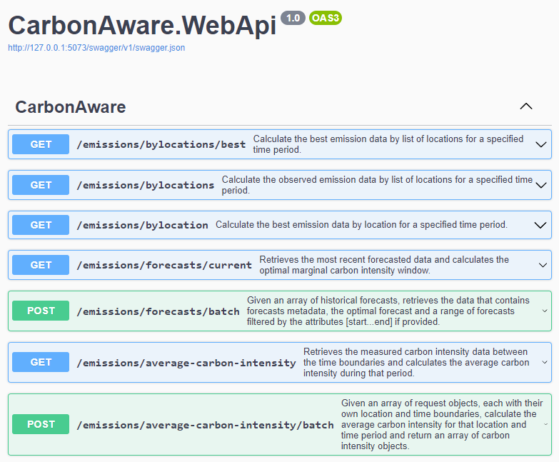

# Carbon Aware SDK
You can reduce the carbon footprint of your application by just running things at different times and in different locations. That is because not all electricity is produced in the same way. Most is produced through burning fossil fuels, some is produced using cleaner sources like wind and solar.

When software does more when the electricity is clean and do less when the electricity is dirty, or runs in a location where the energy is cleaner, we call this **carbon aware software**.

The Carbon Aware SDK helps you build the carbon aware software solutions with the intelligence to use the greenest energy sources. Run them at the greenest time, or in the greenest locations, or both! Capture consistent telemetry and report on your emissions reduction and make informed decisions.

With the Carbon Aware SDK you can build software that chooses to run when the wind is blowing, enable systems to follow the sun, moving around the world to where energy is the greenest, and create tools that give insights and help software innovators to make greener software decisions. All of this helps reduce carbon emissions.

Get started on creating sustainable software innovation for a greener future today!

# Getting Started

Head on over to the [Getting Started Guide](./GettingStarted.md) to get up and running.

# What is the Carbon Aware SDK?

At its core the Carbon Aware SDK is a WebApi and Command Line Interface (CLI) to assist in building carbon aware software. The functionality across the CLI and WebApi is identical by design.

## The WebApi
The WebApi is the preferred deployment within large organisations to centralise management and increase control and auditability, especially in regulated environments. It can be deployed as a container for easy management, and can be deployed alongside an application within a cluster or separately.

## The CLI

The CLI tends to be handy for legacy integration and non-cloud deployments, where a command-line can be used. This tends to be common with legacy DevOps pipelines to drive deployment for integration testing where you can test your deployment in the greenest location.

# Who Is Using the Carbon Aware SDK?

The Carbon Aware SDK is being used by large and small companies around the world. Some of the world’s biggest enterprises and software companies, through to start-ups.

Machine Learning (ML) workloads are a great example of long running compute intensive workloads, that often are also not time critical. By moving these workloads to a different time, the carbon emissions from the ML training can be reduced by up to 15%, and by moving the location of the training this can be reduced even further, at times by up to 50% or more.

# Contributing

The Carbon Aware SDK is open for contribution! Want to contribute? Check out the [contribution guide](./CONTRIBUTING.md).

# Green Software Foundation Project Summary

The Carbon Aware SDK is a project as part of the [Green Software Foundation](https://greensoftware.foundation/) (GSF) and the GSF Open Source Working Group.

## Appointments

-   Chair/Project lead - Vaughan Knight (Microsoft)
-   Vice Chair - Szymon Duchniewicz (Avanade)

## GSF Project Scope

For developers to build carbon aware software, there is a need for a unified baseline to be implemented. The Carbon Aware Core SDK is a project to build a common core, that is flexible, agnostic, and open, allowing software and systems to build around carbon aware capabilities, and provide the information so those systems themselves become carbon aware.

The Carbon Aware Core API will look to standardise and simplify carbon awareness for developers through a unified API, command line interface, and modular carbon-aware-logic plugin architecture.
