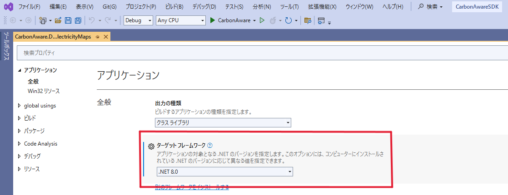
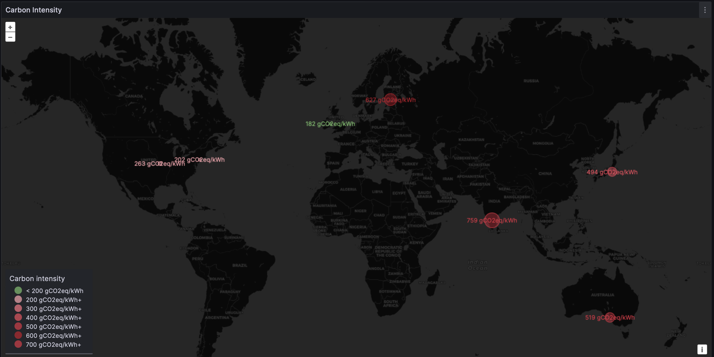
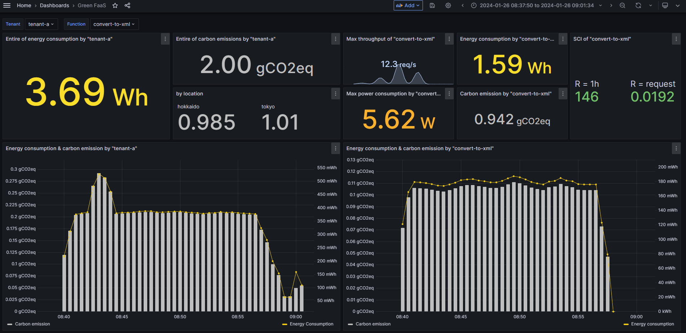

As most software nowadays, the Carbon Aware SDK relies on a stack of utilities, and while adding a new feature is usually the most appealing for a project, it’s also critical to maintain the stack, especially in a community effort.

Containerization has helped shift the upgrading work to a more convenient time for the development team, but there are still various motivations for keeping a stack up to date with current versions: security, bug fixes, performance, support… but the best is to couple with new feature development: such was the case for the .NET framework.

However, those updates often have ripple effects, as their dependencies are not always foreseeable, making the software upgrade workload hard to predict.

As NTT and NTT DATA were key participants in this contribution, this is a good occasion to cast a light on the behind the scenes, and the way this new Carbon Aware SDK is being used internally.

# Why .NET 8 ?

Carbon Aware SDK v1.4.0 was released in May 2024. Its core evolution was the upgrade to .NET 8. Until v1.3.x, the Carbon Aware SDK relied on the LTS (Long Term Support) version .NET 6. With an EOL (End of Life) set for November 2024, an upgrade was unavoidable.

Microsoft released .NET 8 in November 2023, the latest LTS version of .NET, which [will be supported until November 2026](https://dotnet.microsoft.com/en-us/platform/support/policy/dotnet-core). 

Wanting to display the Software Carbon Intensity ([SCI - Software Carbon Intensity](https://sci.greensoftware.foundation/) as adopted in [ISO/IEC 21031:2024](https://www.iso.org/standard/86612.html)) metrics from the Carbon Aware SDK WebAPI made .NET 8 a requirement, as .NET 8 introduced [enhanced support for implementing metrics features](https://learn.microsoft.com/en-us/dotnet/core/whats-new/dotnet-8/runtime#extensions-metrics).

Indeed, the newly introduced [IMeterFactory](https://learn.microsoft.com/en-us/dotnet/api/system.diagnostics.metrics.imeterfactory?view=net-8.0) interface enabled us to create a [Meter](https://learn.microsoft.com/en-us/dotnet/api/system.diagnostics.metrics.meter?view=net-8.0) instance while maintaining modularity by using dependency injection (i.e. use the .NET 8 implementation of the feature, instead of recreating it… another software development sustainable pattern). 

In summary, Carbon Intensity metrics handling was combined with the necessary support extension that the .NET 8 upgrade provides.

# In practice

The initial work for upgrading to .NET 8 was done in [Pull Request #404](https://github.com/Green-Software-Foundation/carbon-aware-sdk/pull/404) (aka PR, a code change proposal, which once approved will be merged in the main code).

Without being a C# expert, it’s still interesting to look at the PR and see that: it involves several individuals working together as a community, many files were impacted, and highlights the importance of tests and samples, which required further work due to some ripple effects.

For the nitty gritty (else jump to the next paragraph): the core work is “simply” updating the target framework version. 

It can be done in the property window of each of the C# projects, for example, in the Japanese version of Visual Studio (Fig.1).



Fig.1 Property window of C# project in Carbon Aware SDK on Visual Studio Community Edition

Carbon Aware SDK includes 30 C# projects (in v1.3.0 at least), so automation is welcomed. The target framework version is described in `/Project/PropertyGroup/TargetFramework` in the `.csproj` file. For example, running the command on WSL:

```
find . -name "*.csproj" -exec sed -i 's|^\(\s\+\)<TargetFramework>net6.0</TargetFramework>$|\1<TargetFramework>net8.0</TargetFramework>|g' {} \;
```

The .NET version is specified in many other places, which need to be updated as well (`grep` will list them all).

* Base image in Docker file
    * Use tag `8.0` instead of `6.0` for `mcr.microsoft.com/dotnet/sdk`
* Tool configurations
    * global.json
    * dotnet-tools.json
    * launch.json for VSCode
* Target framework version for OpenAPI generator for .NET
* .NET version for [actions/setup-dotnet](https://github.com/actions/setup-dotnet) in GitHub Actions Workflow
* Comments in source files
* Documents

While the updating part is done, the work does not end there…

# Unexpected work items

While the .NET 8 upgrade was done, some unexpected issues surfaced. 

## Ripple effect on sample code

To help onboard newcomers to the Carbon Aware SDK, a sample running on Azure Functions is provided.

Azure Functions for .NET is transitioning one of its execution modes (the In-process model) to the Isolated worker model ([more details here](https://learn.microsoft.com/en-us/azure/azure-functions/dotnet-isolated-in-process-differences)). Moreover, .NET 8 did not yet provide an option to use the former model in its initial release (cf. [roadmap of Azure Functions](https://techcommunity.microsoft.com/t5/apps-on-azure-blog/net-on-azure-functions-august-2023-roadmap-update/ba-p/3910098)).

As our sample was still implementing the in-process model (to be deprecated and not available in .NET 8 at this time), it made sense to migrate to the isolated worker model.

For the code lover, there is a helpful [guide](https://learn.microsoft.com/en-us/azure/azure-functions/migrate-dotnet-to-isolated-model?tabs=net8) for the migration. This led to:

* Change the version of container images to build and test
* Update the `.csproj` file
* Replace `Startup.cs` with `Program.cs`
* Replace `FunctionName` attribute with `Function`
* Change loggers to be obtained from the DI container
* Update the document

For more details browse: [Pull Request #420](https://github.com/Green-Software-Foundation/carbon-aware-sdk/pull/420).

## Port Number Breaking change

As the Carbon Aware SDK WebAPI uses ASP.NET Core technology, another collateral change was required since .NET 8 changed its default port number from 80 to 8080 [Microsoft Learn document](https://learn.microsoft.com/en-us/dotnet/core/compatibility/containers/8.0/aspnet-port)).

Changing the port number from WebAPI container affects the containerPort in the Helm chart and some GitHub Workflows that uses WebAPI.

## Broken build pipeline on GitHub Actions

Thanks to GitHub, a lot of automation is available to publish code, allowing contributors to focus more on coding. In particular, the Carbon Aware SDK repository is configured to publish the WebAPI container image (like a snapshot build) when a commit occurs on the dev branch.

However, it suddenly stopped working after the .NET 8 upgrade.

The team investigated the logs (Fig. 2), as a container image for both AMD64 and Arm64 Linux in GitHub Actions with [docker/build-push-action](https://github.com/docker/build-push-action): a mysterious segmentation fault (SEGV) was occurring after the upgrade… the code was not changed,  `dotnet publish` was outside the scope.

```
 > [linux/arm64 build-env 4/6] RUN dotnet publish CarbonAware.WebApi/src/CarbonAware.WebApi.csproj -c Release -o publish:
7.209 MSBuild version 17.9.6+a4ecab324 for .NET
24.69   Determining projects to restore...
41.42 Segmentation fault (core dumped)
```

Fig.2 Logs in `dotnet publish` on GitHub Actions

Further investigation was done, and thanks to a [.NET blog](https://devblogs.microsoft.com/dotnet/improving-multiplatform-container-support/) about multi-platform container support, we identified that an unsupported approach was used for the build, and needed to be amended. More precisely, since .NET 6, QEMU static binaries were used to build container images for multi-platform.

Fortunately, the .NET blog guides how to build multi-platform container images, and the workflow was fixed accordingly in [Pull Request #498](https://github.com/Green-Software-Foundation/carbon-aware-sdk/pull/498). So the WebAPI container image with .NET 8 can be pulled from [GitHub Packages](https://github.com/Green-Software-Foundation/carbon-aware-sdk/pkgs/container/carbon-aware-sdk) now!

# Use case in NTT / NTT DATA

While NTT & NTT DATA have been contributing to the Carbon Aware SDK for a long time, we had not previously publicly referenced our [adoption of the tool](https://github.com/Green-Software-Foundation/carbon-aware-sdk/blob/dev/casdk-docs/docs/overview/adopters.md).

The Carbon Aware SDK v1.4.0 carbon metrics exporter (dependent on .NET8 upgrade) has increased the usefulness of the SDK due to increased visualization capabilities now available.

## Carbon Intensity map

This feature facilitates integration with monitoring solutions like [Prometheus](https://prometheus.io/) and furthermore with a visualization solution like [Grafana](https://grafana.com/docs/grafana/latest/panels-visualizations/visualizations/): unlocking geomap style visualization (showing metrics at specified locations on a map). By enabling the exporter and making some settings on Grafana, carbon intensities can be exported from Carbon Aware SDK to a geomap, this is part of a dashboard to monitor carbon emissions for software systems.

The Carbon Intensity can be intuitively visualized with size and colors on a geomap. Beyond raising awareness, this can guide decisions on location or time shift.



## Green Dashboard for Kubernetes

Carbon Aware SDK helps increase awareness around Carbon emission, and it is now possible to monitor carbon emission per application within Kubernetes.

In practice, each container's energy consumption is evaluated through [Kepler](https://www.cncf.io/projects/kepler/) (sandbox project in Cloud Native Cloud Foundation, [CNCF](https://www.cncf.io/)), and thanks to the Carbon Aware SDK, the carbon emission can be evaluated.

All those emission data from power grid can be accessed through the Prometheus exporter with the Carbon Aware SDK (starting v1.4.0), and visualized with the Grafana dashboard.

The power consumption, energy consumption, carbon emission, and SCI can be seen at a glance!

One of the upsides of micro-services architecture, as Kubernetes facilitates it, is to be able to work on different pieces of an application in a relatively independent fashion (maintaining, scaling, optimizing…).

The Green Dashboard allows a team to check an application's global energy consumption and carbon emission (dashboard left side), while drilling down into sustainability-related metrics for each micro-service (dashboard right side).

It shows the SCI, allowing to get a sense of the rate of Carbon Emission down to a particular piece of an architecture (R being the [functional unit](https://learn.greensoftware.foundation/measurement/#software-carbon-intensity-specification) for that service - for example, an API call, the data is being shown per R unit or over an hour).

While in monolithic application optimization needs customized instrumentation, and often have rippled effects, this green dashboard helps identify which micro-service refactoring would have the maximum impact on the application's carbon footprint, leveraging the team effort more efficiently.



# Moving Forward

With the Cloud Computing expansion, and Kubernetes flexibility, more and more choices exist for running a workload. While business and economic constraints often lead those decisions, the carbon footprint is becoming an increasingly critical consideration.

This is a difficult endeavor, and the first step is to know where one stands, measure but also later evaluate and confirm what action would lead to improvement. That was one of the intentions behind the Green Dashboard for Kubernetes, and the Carbon Aware SDK 1.4 is a key element in this approach.

By providing a standard interface to the carbon emissions of the energy, the Carbon Aware SDK is a key element for IT sustainability: from evaluating current carbon footprint up to taking into account carbon intensity for geo or time shifting…

Thanks to the community effort the first step is a click away with the [quickstarting guide](https://carbon-aware-sdk.greensoftware.foundation/docs/quickstart), available for everyone.

No excuse!
