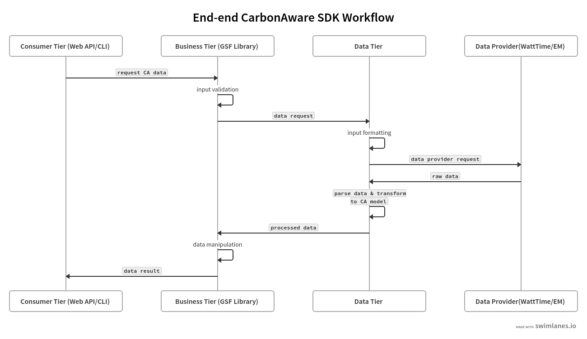

# 0013. Remove Aggregator layer from the Carbon Aware Architechture

## Status

Approved

## Context
The Carbon Aware SDK provides a public library to retrieve carbon emissions data. The library consists of public handler interfaces and data models that can be consumed by any consumer layer like WebAPI, CLI, Azure Functions etc.
With the inclusion of these handlers, the Aggregator layer has now become obsolete. It is has been replaced by the handlers, which are more aligned with the carbon intensity feature.
The current workflow in the repo looks like this- Consumer==>CA Library==>Aggregator==>Datasource. 

## Decision

The proposal is to remove the Aggregator layer from the architechture, and make the Handlers act as the business layer between the consumer and the data source.
GSF Library handlers will be responsible for taking in consumer requests, calling the specified data source, and performing any necessary logic before returning the result to the consumer. 
The Consumer layer will call the public interfaces in the library, thereby defining clear access boundaries between the different layers. This will eliminate any references to the Aggregator layer and we can safely remove it from the SDK without changing the existing functionality.   

## Sequence diagram

## Benefits

- Clear access boundaries defined
- Less code to maintain
- Smaller size of packaged binary 
- Clear separation of concerns between different layers

## Green Impact

Neutral

