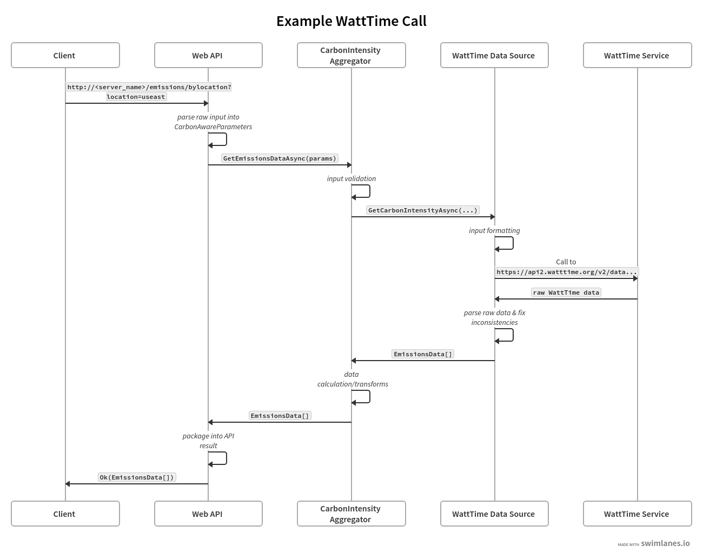

# Carbon Aware WebApi

The Carbon Aware SDK provides an API to get the marginal carbon intensity for a given location and time period. The values reported in the Green Software Foundation's specification for marginal carbon intensity (Grams per Kilowatt Hour).

***Highly Recommended*** - This user interface is best for when you can change the code, and deploy separately.  This also allows you to manage the Carbon Aware logic independently of the system using it.

The WebApi replicates the CLI and SDK functionality, leveraging the same configuration and providing a REST end point with Swagger/OpenAPI definition for client generation

## Table of Contents

- [Carbon Aware WebApi](#carbon-aware-webapi)
  - [Table of Contents](#table-of-contents)
  - [Endpoints](#endpoints)
    - [GET emissions/bylocation](#get-emissionsbylocation)
    - [GET emissions/bylocations](#get-emissionsbylocations)
    - [GET emissions/bylocations/best](#get-emissionsbylocationsbest)
    - [GET emissions/forecasts/current](#get-emissionsforecastscurrent)
    - [POST emissions/forecasts/batch](#post-emissionsforecastsbatch)
    - [GET emissions/average-carbon-intensity](#get-emissionsaverage-carbon-intensity)
    - [POST emissions/average-carbon-intensity/batch](#post-emissionsaverage-carbon-intensitybatch)
    - [GET emissions/locations](#get-emissionslocations)
  - [Error Handling](#error-handling)
  - [Autogenerate WebAPI](#autogenerate-webapi)
  - [Data Sources](#data-sources)
    - [WattTime](#watttime)
      - [Locations](#locations)
      - [Exception Handling](#exception-handling)
      - [Example Emissions Call Using WattTime](#example-emissions-call-using-watttime)
    - [ElectricityMaps](#electricityMaps)
      - [Locations](#locations)
      - [Exception Handling](#exception-handling)

## Endpoints

### GET emissions/bylocation

This endpoint calculates the observed emission data by location for a specified time period.

Location is a required parameter and is name of the data region for the configured Cloud provider.
If time period is not provided, it retrieves available data until the current time.

```text
https://<server_name>/emissions/bylocation?location=useast&time=2022-01-01&toTime=2022-05-17
```

The response is an array of EmissionsData objects that contains the location, time and the rating in g/kWh

```json
[
 {
  "location":"eastus",
  "time":"2022-05-17T20:45:11.5092741+00:00",
  "rating":70
 }
]
```

### GET emissions/bylocations

This endpoint calculates the observed emission data by an array of locations for a specified time period

Location is a required parameter and is an array of the names of the data region for the configured Cloud provider.
If time period is not provided, it retrieves all the data until the current time.

```text
https://<server_name>/emissions/bylocations?locations=eastus&locations=westus&time=2022-01-01&toTime=2022-05-17
```

The response is an array of EmissionsData objects that contains the location, time and the rating in g/kWh.

```json
[
  {
    "location":"eastus"
    "time":"2022-05-17T20:45:11.5092741+00:00",
    "rating":70
  }
]
```

### GET emissions/bylocations/best

This endpoint calculates the best observed emission data by an array of locations for a specified time period

Location is a required parameter and is an array of the names of the data region for the configured Cloud provider.
If time period is not provided, it retrieves all the data until the current time.

```text
https://<server_name>/emissions/bylocations/best?locations=eastus&locations=westus&time=2022-01-01&toTime=2022-05-17
```

The response is an array of EmissionsData objects that contains the location, time and the rating in g/kWh.

```json
[
  {
    "location":"eastus"
    "time":"2022-05-17T20:45:11.5092741+00:00",
    "rating":70
  }
]
```

### GET emissions/forecasts/current

This endpoint fetches only the most recently generated forecast for all provided locations.
It uses the "dataStartAt" and "dataEndAt" parameters to scope the forecasted data points (if available for those times).
If no start or end time boundaries are provided, the entire forecast dataset is used. The scoped data points are used to calculate average marginal carbon intensities of the specified "windowSize" and the optimal marginal carbon intensity window is identified.

The forecast data represents what the data source predicts future marginal carbon intesity values to be, not actual measured emissions data (as future values cannot be known).

This endpoint is useful for determining if there is a more carbon-optimal time to use electicity predicted in the future.

Parameters:

1. `location`: This is a required parameter and is an array of the names of the data region for the configured Cloud provider.
2. `dataStartAt`: Start time boundary of the current forecast data points. Ignores current forecast data points before this time. Must be within the forecast data point timestamps. Defaults to the earliest time in the forecast data.
3. `dataEndAt`: End time boundary of the current forecast data points. Ignores current forecast data points after this time. Must be within the forecast data point timestamps. Defaults to the latest time in the forecast data.
If neither `dataStartAt` nor `dataEndAt` are provided, all forecasted data points are used in calculating the optimal marginal carbon intensity window.
4. `windowSize`: The estimated duration (in minutes) of the workload. Defaults to the duration of a single forecast data point.

```text
https://<server_name>/emissions/forecasts/current?location=northeurope&dataStartAt=2022-07-19T14:00:00Z&dataEndAt=2022-07-20T04:38:00Z&windowSize=10
```

The response is an array of forecasts (one per requested location) with their optimal marginal carbon intensity windows.

```json
[
  {
    "requestedAt": "2022-07-19T13:37:49+00:00",
    "generatedAt": "2022-07-19T13:35:00+00:00",
    "location": "northeurope",
    "dataStartAt": "2022-07-19T14:00:00Z",
    "dataEndAt": "2022-07-20T04:38:00Z",
    "windowSize": 10,
    "optimalDataPoint": {
      "location": "IE",
      "timestamp": "2022-07-19T18:45:00+00:00",
      "duration": 10,
      "value": 448.4451043375
    },
    "forecastData": [
      {
        "location": "IE",
        "timestamp": "2022-07-19T14:00:00+00:00",
        "duration": 10,
        "value": 532.02293146
      },
      ...
      {
        "location": "IE",
        "timestamp": "2022-07-20T04:25:00+00:00",
        "duration": 10,
        "value": 535.7318741001667
      }
    ]
  }
]
```

### POST emissions/forecasts/batch

This endpoint takes a batch of requests for historical forecast data, fetches them, and calculates the optimal marginal carbon intensity windows for each using the same parameters available to the '/emissions/forecasts/current' endpoint.

This endpoint is useful for back-testing what one might have done in the past, if they had access to the current forecast at the time.

Parameters:

1. requestedForecasts: Array of requested forecasts. Each requested forecast contains
    - `requestedAt`: This is a required parameter and is the historical time used to fetch the most recent forecast as of that time.
    - `location`: This is a required parameter and is the name of the data region for the configured Cloud provider.
    - `dataStartAt`: Start time boundary of the forecast data points. Ignores forecast data points before this time. Must be within the forecast data point timestamps. Defaults to the earliest time in the forecast data.
    - `dataEndAt`: End time boundary of the forecast data points. Ignores forecast data points after this time. Must be within the forecast data point timestamps. Defaults to the latest time in the forecast data.
    - `windowSize`: The estimated duration (in minutes) of the workload. Defaults to the duration of a single forecast data point

If neither `dataStartAt` nor `dataEndAt` are provided, all forecasted data points are used in calculating the optimal marginal carbon intensity window.

```json
[
  {
    "location": "eastus",
    "dataStartAt": "2022-06-01T14:00:00Z",
    "dataEndAt": "2022-06-01T18:00:00Z",
    "windowSize": 30,
    "requestedAt": "2022-06-01T12:01:00Z"
  },
  {
    "location": "westus",
    "dataStartAt": "2022-06-13T08:00:00Z",
    "dataEndAt": "2022-06-13T10:00:00Z",
    "windowSize": 30,
    "requestedAt": "2022-06-13T6:05:00Z"
  }
]
```

The response is an array of forecasts (one per requested location) with their optimal marginal carbon intensity windows.

```json
[
  {
    "generatedAt": "2022-06-01T12:00:00+00:00",
    "optimalDataPoint": {
      "location": "IE",
      "timestamp": "2022-06-01T16:45:00+00:00",
      "duration": 10,
      "value": 448.4451043375
    },
    "forecastData": [ ... ] // all relevant forecast data points
    "requestedAt": "2022-06-01T12:01:00"
    "location": "eastus",
    "dataStartAt": "2022-06-01T14:00:00Z",
    "dataEndAt": "2022-06-01T18:00:00Z",
    "windowSize": 30,
  },
  {
    "generatedAt": "2022-06-13T06:05:00+00:00",
    "optimalDataPoint": {
      "location": "IE",
      "timestamp": "2022-06-13T09:25:00+00:00",
      "duration": 10,
      "value": 328.178478
    },
    "forecastData": [ ... ] // all relevant forecast data points
    "requestedAt": "2022-06-13T06:05:00"
    "location": "westus",
    "dataStartAt": "2022-06-13T08:00:00Z",
    "dataEndAt": "2022-06-13T10:00:00Z",
    "windowSize": 30,
  }
]
```

### GET emissions/average-carbon-intensity

This endpoint retrieves the measured carbon intensity data between the time boundaries and calculates the average carbon intensity during that period. Location is a required parameter and is the name of the data region for the configured Cloud provider.

This endpoint is useful for reporting the measured carbon intensity for a specific time period in a specific location.

Parameters:

1. `location`: This is a required parameter and is the string name of the data region for the configured Cloud provider.
2. `startTime`: The time at which the workload and corresponding carbon usage begins.
3. `endTime`: The time at which the workload and corresponding carbon usage ends.

```text
https://<server_name>/emissions/average-carbon-intensity?location=eastus&startTime=2022-07-19T14:00:00Z&endTime=2022-07-19T18:00:00Z
```

The response is a single object that contains the information about the request and the average marginal carbon intensity

```json
{
  "location": "eastus",
  "startTime": "2022-07-19T14:00:00Z",
  "endTime": "2022-07-19T18:00:00Z",
  "carbonIntensity": 345.434
}
```

### POST emissions/average-carbon-intensity/batch

This endpoint takes an array of request objects, each with their own location and time boundaries, and calculates the average carbon intensity for that location and time period.

This endpoint only supports batching across a single location with different time boundaries. If multiple locations are provided, an error is returned. For each item in the request array, the application returns a corresponding object containing the location, time boundaries, and average marginal carbon intensity.

Parameters:

1. requestedCarbonIntensities: Array of requested carbon intensities. Each requested carbon intensity contains
    - `location`: This is a required parameter and is the name of the data region for the configured Cloud provider.
    - `startTime`: The time at which the workflow we are requesting carbon intensity for started.
    - `endTime`: The time at which the workflow we are requesting carbon intensity for ended.

```json
[
  {
    "location": "eastus",
    "startTime": "2022-05-01T14:00:00",
    "endTime": "2022-05-01T18:00:00"
  },
  {
    "location": "eastus",
    "startTime": "2022-06-01T14:00:00",
    "endTime": "2022-06-01T18:00:00"
  },
  {
    "location": "eastus",
    "startTime": "2022-07-01T14:00:00",
    "endTime": "2022-07-01T18:00:00"
  }
]
```

The response is an array of CarbonIntensityDTO objects which each have a location, start time, end time, and the average marginal carbon intensity over that time period.

```json
[
  {
    "carbonIntensity": 32.935208333333335,
    "location": "eastus",
    "startTime": "2022-05-01T14:00:00-04:00",
    "endTime": "2022-05-01T18:00:00-04:00"
  },
  {
    "carbonIntensity": 89.18215277777779,
    "location": "eastus",
    "startTime": "2022-06-01T14:00:00-04:00",
    "endTime": "2022-06-01T18:00:00-04:00"
  },
  {
    "carbonIntensity": 10.416875,
    "location": "eastus",
    "startTime": "2022-07-01T14:00:00-04:00",
    "endTime": "2022-07-01T18:00:00-04:00"
  }
]
```

### GET emissions/locations

This endpoint lists all the supported locations that the datasources potentially can have access to. This information is coming from the `location-source/json` files, that contain dictionaries in the form of <A Location key name, GeoCoordinates>, for instance:

```json
{
  "eastus": {
    "Latitude": 37.3719,
    "Longitude": -79.8164,
    "Name": "eastus"
  },
  ...
  "switzerlandnorth":{
    "Latitude": 47.451542,
    "Longitude": 8.564572,
    "Name": "switzerlandnorth"
  }
}
```

`Emissions` and `Forecasts` endpoints would use the location's `key` name returned by the `emssions/locations` endpoint.

**Note**: If there is ***a location key name*** collision while loading two or more location json files and there is no `LocationDataSourcesConfiguration` `Prefix` and/or `Delimiter` settings, the system would change the collision key name by appending an underscore character and a sequence number to it (i.e. `<key name>`***_seqnumber***). For instance two location json files having `swedencentral` as key, after loading, it would become:

```json
{
  "swedencentral": {
    "Latitude": 60.67488,
    "Longitude": 17.14127,
    "Name":"swedencentral"
  },
  ...
  "swedencentral_1": { // key collision. key renamed.
    "Latitude": null,
    "Longitude": null,
    "Name": "SE"
  },
  ...
}
```

If there is a third file with the same key name, it would be `swedencentral_2` and so on. This information is not persisted, but now the user can make requests using `swedencentral` and/or `swedencentral_1`.

## Error Handling

The WebAPI leveraged the [.Net controller filter pipeline](https://docs.microsoft.com/en-us/aspnet/core/mvc/controllers/filters?view=aspnetcore-6.0) to ensure that all requests respond with a consistent JSON schema.


Controllers are responsible for managing the "Success" responses.  If an error occurs in the WebAPI code and an unhandled exception is thrown, the [custom Exception Filter](./Filters/HttpResponseExceptionFilter.cs) will manage converting that exception into the appropriate JSON response.  NOTE: The Exception Filter is only used for unhandled exceptions.  If the exception is caught and handled by the WebAPI code, the controller will continue to manage the response.

The .Net framework will automatically respond to validation errors with a [ValidationProblemDetails](https://docs.microsoft.com/en-us/dotnet/api/microsoft.aspnetcore.mvc.validationproblemdetails?view=aspnetcore-6.0) object.  Using the Exception Filter class enables the WebAPI to consistently respond with the `ValidationProblemDetails` error schema in all error cases and take advantage of error handling automatically provided by the framework.


## Autogenerate WebAPI

Using the following steps, it is possible to get the CarbonAware WebApi OpenAPI specification

1. Make sure the current directory is `<path to project root>/src/`

    ```sh
    dotnet restore
    cd CarbonAware.WebApi/src
    dotnet tool restore
    dotnet build --configuration Release --no-restore
    dotnet tool run swagger tofile --output ./api/v1/swagger.yaml --yaml bin/Release/net6.0/CarbonAware.WebApi.dll v1
    ```

1. The `CarbonAware.WebApi/src/api/v1/swagger.yaml` file contains the supported OpenApi specification.
1. Use for instance [swagger editor](https://editor.swagger.io) to see and try the endpoint routes.

## Data Sources

### WattTime

#### Locations

Each WattTime emissions data point is associated with a particular named balancing authority. For transparency, this value is also used in `EmissionsData` response objects. It is not overwritten to match the named datacenter provided by any request.

> "A balancing authority ensures, in real time, that power system demand and supply are finely balanced. This balance is needed to maintain the safe and reliable operation of the power system. If demand and supply fall out of balance, local or even wide-area blackouts can result."
>
> See [this post](https://www.eia.gov/todayinenergy/detail.php?id=27152) on balancing authories from the EIA to learn more.

#### Exception Handling

If WattTime responds with a 4XX or 5XX status code the WattTime Data Source will forward the response code and message back to the caller.  Refer to the [current WattTime documentation](https://www.watttime.org/api-documentation/) for the most up-to-date information about possible error codes.

#### Example Emissions Call Using WattTime
The swimlanes diagram below follows an example request for emissions data using WattTime as the data source provider. In this diagram, the _Client_ is a user of the SDK and the _WattTimeService_ is the [WattTime](https://www.wattime.org) API.



### ElectricityMaps

#### Locations

Each ElectricityMaps emissions data point is associated with a particular named zone. While the ElectricityMaps endpoint supports calling with lat/long geoposition as well, the result will always be a corresponding zone name. They provide a [route on their API](https://static.electricitymaps.com/api/docs/index.html#zones) which can be queried to list all the zone names you have access to given your token

#### Exception Handling

If ElectricityMaps responds with a 4XX or 5XX status code the ElectricityMaps Data Source will forward the response code and message back to the caller. Refer to the [ElectricityMapsHttpClientException](../src/CarbonAware.DataSources/CarbonAware.DataSources.ElectricityMaps/src/Client/ElectricityMapsClientHttpException.cs) class for documentation on expected error codes.
