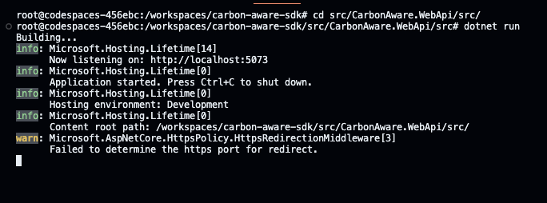
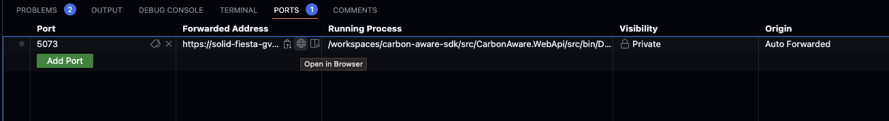

Launching the SDK in github Codespaces
========

> Note: These instructions do not include anything about 

Browse to the folder
```sh
cd src/CarbonAware.WebApi/src/
```

Run the project
```sh
dotnet run
```

It should look like that



You can then select the browser icon to open in the browser



> Note: the URL to browse needs to have that format: https://<codespace public URL>/swagger

Make sure to browser to the swagger UI by appending `/swagger` to the URL, and the following should open.


