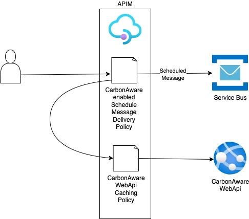

<!-- markdownlint-disable MD024 -->
# Azure API Management Policy

This folder contains a sample integration of the [Carbon Aware SDK](https://github.com/Green-Software-Foundation/carbon-aware-sdk)
with [Azure API Management](https://azure.microsoft.com/en-us/products/api-management/) (APIM)
[policies](https://learn.microsoft.com/en-us/azure/api-management/api-management-howto-policies).

By integrating the Carbon Aware SDK at the API gateway level
backend API's and/or downstream consumers are able to do their work
at optimal carbon intensity times without any knowledge of the
underlying system that determines those times. This can be especially
valuable in situations where the integration is with legacy systems
or systems that cannot be readily modified to include carbon awareness.

This sample includes two use cases:

1. [Request routing](#request-routing)
2. [Scheduled message delivery](#scheduled-message-delivery)

In both use cases the Carbon Aware Web.Api is accessed behind an
APIM API to take advantage of response caching. This allows a high volume
API to use the Carbon Aware Web.Api without concerns of being
throttled by the underlying services that the Carbon Aware SDK
uses to provide the forecast data.

## Request routing

The request routing policy sample source can be found here - [request-routing-policy.xml](request-routing-policy.xml).

### Overview

The `request routing` use case involves an APIM policy that routes requests
based on the current carbon intensity in the target regions/data centers.
In the sample policy, requests are routed to the [backend API](https://learn.microsoft.com/en-us/azure/api-management/backends)
in the region with the lowest carbon intensity.

This use case can be implemented in cases where requests are time
sensitive and cannot take advantage of time shifting for optimal future
carbon intensity usage.

### Dependencies

This use case has the following dependencies:

* Azure API Management
* Carbon Aware SDK Web.Api
  * represented as `my-apim-instance.azure-api.net/emissions/forecasts` in the sample code
* A backend web API deployed in multiple regions
  * represented as `my-app-eastus.azurewebsites.net` &
    `my-app-westus.azurewebsites.net` in the sample code

### Enhancements & considerations

This sample policy is a simple implementation to demonstrate how
the Carbon Aware SDK can be integrated into APIM. A few high
level enhancements and considerations are outlined below.

* Integration with hard coded regions is for demonstration purposes
only and should be automated or an alternate approach for region
configuration should be considered.
* It may be necessary to include other factors into the routing
decision. This sample focuses purely on carbon intensity.

## Scheduled message delivery

The scheduled message delivery policy sample source can be found here - [scheduled-message-delivery-policy.xml](scheduled-message-delivery-policy.xml).

### Overview

The `scheduled message delivery` use case involves a policy that is
carbon aware and exposes a service bus queue through APIM. Message
delivery is scheduled based on the optimal future carbon intensity
forecast. This use case is designed for non time-sensitive workloads that
can tolerate delayed processing.

This implementation takes advantage of Azure Service Bus [scheduled
messages](https://learn.microsoft.com/en-us/azure/service-bus-messaging/message-sequencing#scheduled-messages)
where messages can be submitted to a queue or topic for
delayed processing. Scheduled messages don't materialize in the
queue until the defined enqueue time which is defined using the
`ScheduledEnqueueTimeUtc` message property.

### Dependencies

This sample uses the following services/components:

* Azure API Management
* Azure Service Bus
* Carbon Aware SDK Web.Api
  * represented as `my-apim-instance.azure-api.net/emissions/forecasts` in the sample code

### Enhancements & considerations

This sample policy is a simple implementation to demonstrate how
the Carbon Aware SDK can be integrated into APIM. A few high
level enhancements and considerations are outlined below.

* The specific message delivery time is based on the most optimal
carbon intensity forecast value. To provide more control to the
caller the request can include a time window that can be used to
select the lowest carbon intensity value in the specified window.
* This sample is using an API facade on top of a service bus queue to
incorporate carbon awareness. Additional response information would
most likely be needed in a real world scenario.
