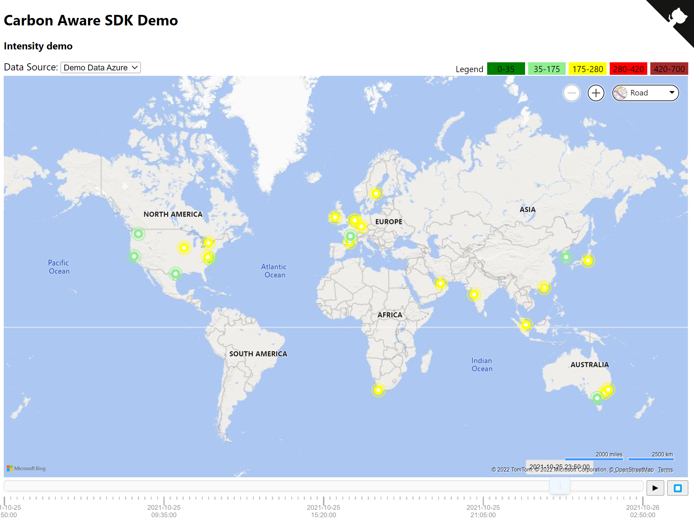
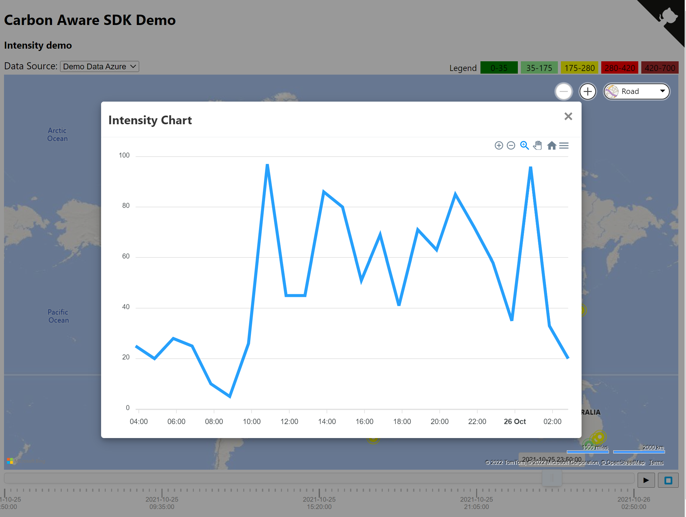

# Carbon Aware SDK Demo

This is a single page HTML with the objective to demonstrate the usage of the SDK.

At this point in time, it just simulates the usage of the API and provides a graphical visualization of the results.

User can select a sample data source and the intensity rating is represented on a world wide map.



User can see the intensity variation across time by doing two actions:

- Play the time bar and observe a hourly evolution on the map
- Clicking on a location and see the evolution chart:



## Technical details

The page uses vanilla javascript and external libraries:
- [Bing Maps](https://docs.microsoft.com/en-us/bingmaps/v8-web-control/) component
- [Apex Charts](https://apexcharts.com/)
- [noUiSlider](https://github.com/leongersen/noUiSlider)

The source data files, in json format are:

*test-data-azure-emissions.json*

It contains a list of intensity data measurements ("Rating") in a location("Location") and time ("Time")
``` json
[
    {
      "Location": "us:east",
      "Time": "2021-10-25T14:50:00.7665571+11:00",
      "Rating": 90.0
    },
    ...
]
```

*azure_locations.json*

Array with the georeference of locations referenced in the test file above.
"RegionName" is the same as "Location", "Latitude" and "Longitude" are real world coordinates.

``` json
[
  {
    "Latitude": "37.3719",
    "Longitude": "-79.8164",
    "RegionName": "us:east"
  },
...
]
```


## Evolution

The current version uses a static data file. Next version should provide some additional features:

- Connection to a live API, enabling the display of near real time data;
- A calculator based on cloud artifacts running on the location; 
